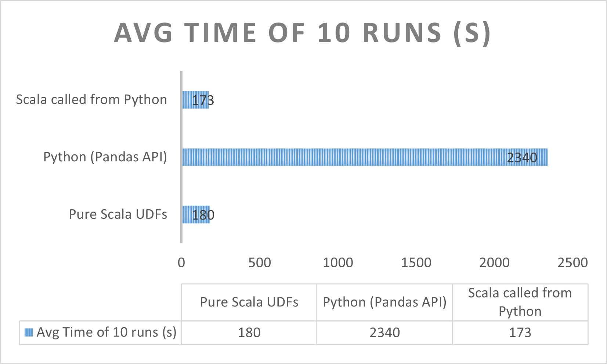

# Writing performance efficient UDFs in Apache PySpark

#### This project demonstrates efficient way of writing custom UDFs in PySpark. Also, a performance benchmarking is provided for Apache PySpark UDFs, Scala UDFs and PySpark UDFs using wrapper classes.

## Why Apache Spark UDFs?
1. Organisations often deal with terabytes of datasets on daily basis for processing. Most of the operations can be performed using Apache Spark built-in SQL functions. 
2. To execute custom or complex functions on dataframe, UDFs provides an edge to operate on trillions of rows efficiently if written correctly.

## Problems with PySpark UDFs
- Spark SQL functions creates the Query Plan under the hood irrespective of languages like Scala and Python and are optimised internally by directly operating on JVM, providing advantages of reduced Serialization, Deserialization and optimisations in Catalyst and Tungsten. However, UDFs being a Blackbox to Spark results in losing many optimisations like Constant Folding, Predicate Pushdowns, etc.


- UDFs written in Python gets executed in Python Worker. <b>In order to do this, Spark transfers the data using Pickled Serialization to JVM and deserializes it back for processing, resulting in a large amount of performance footprints.</b>
- This was improved in Spark 2.3 version by <b>integrating with Apache Arrow and support of Pandas UDFs.</b> Few optimisations were made around data transfer with Arrow Format and vectorized operations supported by Pandas UDfs.

## Scala UDFs referenced from Python
- Considering the problems with UDFs in Python, unfortunately if UDFs are utmost necessity and performance is critical, it leads for thinking of alternative techniques to write UDFs in Python.
- <b>Interestingly, there is a way where we can write UDFs in Scala/Java and provide the Jar to classpath in PySpark and write wrappers over those Scala classes in Python.</b>
- This approach will keep the execution of UDFs in JVM only, and reduces PythonProcess-JVM communications for data serialization and deserialization, which improves the performance almost 15 times.

## Performance Benchmark of Spark UDF Implementations
- Performance evaluation is performed using Spark 3.3.0 on EMR cluster with 3 worker nodes of 'm5d.2xlarge'(24 cores).
- Input dataset used was ~1.5GB and had over 10 million rows.


## Implementing Scala UDFs referenced from Python:
1. UDFs written in Scala:
```
def forReverseAddress(): UserDefinedFunction = {
    def reverseAddressProvider: String => (String, String, String) = { str =>
      val seq = str.split(",").toSeq
      (seq.head, seq(1), seq(2))
    }

    udf(reverseAddressProvider)
  }
```
2. Initialize Scala Classes inside PySpark:
```
UDFBuilder = spark.sparkContext._jvm.com.example.udf.sdk.UDFBuilder
```
3. Calling UDF of Scala from Python:
```
reverseAddressUdfResult = inputDf.withColumn("concat_result", UDFExecutor().apply(reverseAddressUdf, col("CompleteAddress")))
```


