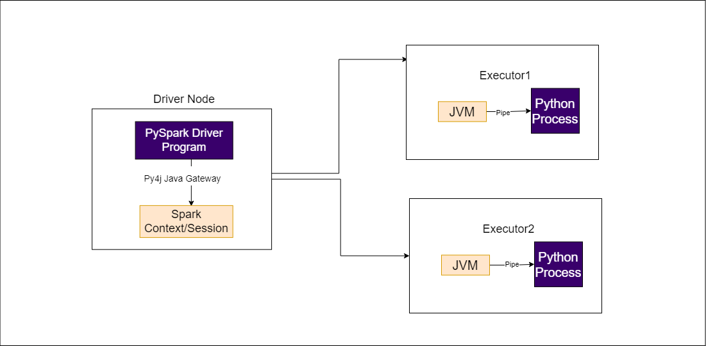

# Writing performance efficient UDFs in Apache PySpark

This project demonstrates efficient way of writing custom UDFs in PySpark. Also, a performance benchmarking is provided for Apache PySpark UDFs, Scala UDFs and PySpark UDFs using wrapper classes.

## Why Apache Spark UDFs?
1. Organisations often deal with terabytes of datasets on daily basis. Most of the operations can be performed using Apache Spark built-in SQL functions. 
2. However, to execute custom or complex functions on dataframe, Spark UDFs provides an edge to operate on trillions of rows efficiently if written correctly.

## Problems with PySpark UDFs
- Spark SQL functions creates the same Query Plan under the hood irrespective of languages like Scala and Python and are optimised internally by directly operating on JVM, providing advantages of reduced Serialization, Deserialization and optimisations in Catalyst and Tungsten. However, UDFs being a Blackbox to Spark results in losing many optimisations like Constant Folding, Predicate Pushdowns, etc.



- UDFs written in Python language gets executed in Python Worker. <b>In order to do this, Spark transfers the data using Pickled Serialization to JVM and deserializes it back for further processing, which results in a large amount of performance footprints.</b>
- This was improved in Spark 2.3 version by <b>integrating with Apache Arrow and support of Pandas UDFs.</b> Few optimisations were made around data transfer with Arrow Format and vectorized operations supported by Pandas UDfs.

## Necessity of PySpark UDFs
- Python is heavily used in the community for the following reasons:
  1. Faster Learning Curve
  2. Easier for Data Analysis and Machine Learning Applications
  2. Wide community support and rich libraries
  4. Negligible Performance Difference
- Although UDFs using Pandas API have a little performance gain as compared to vanilla Python UDFs, UDFs in Scala are always performance efficient.
- For the applications which are peformance critical and UDFs are utmost necessity, python developers still need a better way to implement UDFs.

## Scala UDFs referenced from Python
- <b>Interestingly, there is a way where we can write UDFs in Scala/Java and reference the scala classes from Python UDFs directly.</b>
- This approach will keep the execution of UDFs in JVM only, and reduces PythonProcess-JVM communications for data serialization and deserialization, which improves the performance almost 15 times.

## Performance Benchmark of Spark UDF Implementations
- This project used a generic example for implementing UDFs in Python by calling Scala Code. The actual performance benchmark is carried on a production level code and results are mentioned below. 
- Performance evaluation is done on Spark 3.3.0 on EMR Cluster with 3 worker nodes of 'm5d.2xlarge' (24 cores).
- Input dataset used was ~1.5GB and had over 10 million rows.


## Implementing Scala UDFs referenced from Python:
A jar needs to be created by building the Scala project, and this jar can be provided in the classpath while running PySpark application.

1. Write UserDefinedFunction in Scala:
```
def forReverseAddress(): UserDefinedFunction = {
    def reverseAddressProvider: String => (String, String, String) = { str =>
      val seq = str.split(",").toSeq
      (seq.head, seq(1), seq(2))
    }

    udf(reverseAddressProvider)
  }
```
2. Initialize Scala Classes inside PySpark:
```
UDFBuilder = spark.sparkContext._jvm.com.example.udf.sdk.UDFBuilder

reverseAddressUdf = UDFBuilder().forReverseAddress()
```
3. Calling the UDF in PySpark:
```
reverseAddressUdfResult = inputDf.withColumn("concat_result", UDFExecutor().apply(reverseAddressUdf, col("CompleteAddress")))
```


